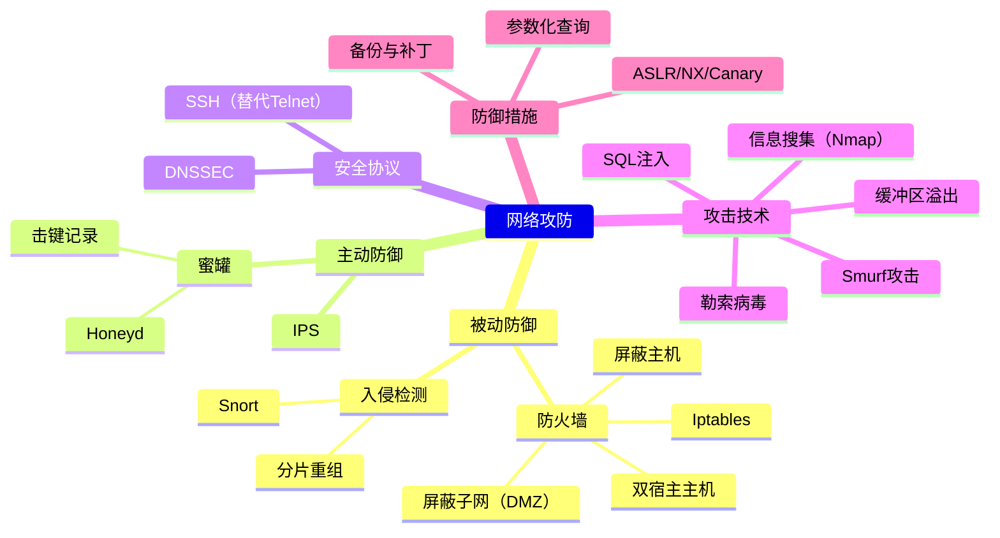

> **教材说明**：王群《网络攻击与防御技术》共 7 章。以下标注 📖 的为教材内容，标注 🔧 的为老师补充的实操/PPT 内容。

## 一、DNSSEC 🔧

### 概述

DNSSEC（Domain Name System Security Extensions）通过数字签名机制解决 DNS 的欺骗和缓存投毒问题。

### 核心机制

- **数字签名**：使用公钥密码对 DNS 资源记录进行签名，验证数据完整性和真实性
- **信任链**：从根域到顶级域到权威域，逐级签名，形成一条信任链（Chain of Trust）
- **新资源记录类型**：
  - **RRSIG**：资源记录签名，包含对 DNS 记录的签名信息
  - **DNSKEY**：存储区域的公钥
  - **DS**（Delegation Signer）：子域公钥的摘要，父域通过 DS 记录建立信任链
  - **NSEC/NSEC3**：证明某个域名不存在，防止 DNS 欺骗

### 工作原理

1. 请求 DNS 记录时，同时返回 RRSIG 签名
2. 用 DNSKEY 中的公钥验证 RRSIG
3. 通过 DS 记录向上验证直到根域（信任锚点）
4. NSEC/NSEC3 证明不存在记录的合法性

### 意义

- 保证 DNS 数据**完整性**和**认证性**（不提供机密性）
- 防止 DNS 缓存投毒、中间人攻击
- 不加密 DNS 查询内容（加密由 DoH/DoT 提供）

---

## 二、0.0.0.0 与 127.0.0.1 的区别 🔧

| 维度 | 0.0.0.0 | 127.0.0.1 |
|------|---------|-----------|
| 含义 | 本机所有 IPv4 地址 | 本机回环地址（localhost） |
| 绑定范围 | 监听所有网卡，**对外暴露** | 仅本地访问，**不对外暴露** |
| 安全性 | 危险，任何外部设备可访问 | 安全，仅本机可访问 |
| 使用场景 | 需要对外提供服务时 | 仅本地进程间通信 |

### OpenClaw 部署中的安全建议

- **禁止绑定 0.0.0.0**：避免将内部服务暴露到公网
- **推荐绑定 127.0.0.1**：仅允许本机访问，降低攻击面
- 若需外部访问，应绑定具体的内网 IP + 配合防火墙规则

---

## 三、主动防御与被动防御 📖（教材第1章 1.2节）

| 维度 | 主动防御 | 被动防御 |
|------|----------|----------|
| 定义 | 主动出击，在攻击发生前/发生时进行干预 | 在攻击发生后检测、响应、恢复 |
| 时机 | 攻击前/攻击进行中 | 攻击后 |
| 典型技术 | 入侵防御系统(IPS)、蜜罐、威胁狩猎、渗透测试 | 防火墙、IDS、日志审计、备份恢复 |
| 特点 | 预防为主，先发制人 | 检测响应，后发制人 |
| 举例 | Snort 的 IPS 模式、主动扫描漏洞 | 查看日志发现入侵、恢复数据 |

### 两者关系

- 主动防御 ≠ 攻击对方（那属于反击，法律灰色地带）
- 实际安全体系中两者**相辅相成**，纵深防御需要多层结合

---

## 四、防火墙的三种体系结构 🔧（老师补充，非教材内容）

### 4.1 双宿主主机结构（Dual-Homed Host）


- 一台主机装有两块网卡，分别连接内外网
- 内外网通信必须经过代理服务
- **关闭路由转发功能**是关键
- 优点：简单；缺点：单点故障

### 4.2 屏蔽主机结构（Screened Host）


- 屏蔽路由器 + 堡垒主机
- 路由器先过滤流量，堡垒主机提供代理服务
- 屏蔽路由器是第一道防线，堡垒主机是第二道
- 比双宿主更安全，外部只能访问堡垒主机

### 4.3 屏蔽子网结构（Screened Subnet / DMZ）


- 在内外网之间增加一个隔离区（DMZ 非军事区）
- DMZ 放置对外服务（Web、邮件、DNS）
- 两层路由器保护，三层防御
- **安全性最高**，适用于大型网络

> **考试重点**：三种体系结构的比较、优缺点分析、适用场景。注意理解各结构中数据包的流向和每层的安全作用。此内容非教材原有章节，来自老师补充讲义。

---

## 五、蜜罐（Honeypot）🔧（老师补充，非教材内容）

### 5.1 蜜罐原理

- **定义**：故意设置的有漏洞的系统/服务，用于引诱攻击者，记录攻击行为
- **核心价值**：让管理员了解攻击手段、收集攻击工具、跟踪攻击者
- **分类**：
  - 低交互蜜罐：模拟服务（如 Honeyd），风险低
  - 高交互蜜罐：真实系统环境，捕获信息多，风险高
- **部署位置**：DMZ、内网、外网均可

### 5.2 Honeyd 配置语法

Honeyd 是低交互蜜罐框架，可模拟多种操作系统和服务。

```bash
# 基础配置模板
create <template_name>
set <template_name> personality "<OS指纹>"
set <template_name> default tcp action reset
set <template_name> default udp action reset
add <template_name> tcp port <端口号> "<脚本路径>"
add <template_name> udp port <端口号> "<脚本路径>"

# 绑定IP
bind <IP地址> <template_name>
```

关键指令：
- `create`：创建虚拟蜜罐模板
- `set personality`：设置模拟的操作系统指纹（如 "Windows XP", "Linux 2.6"）
- `add port`：开放端口并指定处理脚本
- `bind`：将模板绑定到 IP 地址

### 5.3 Honeyd 常用命令

```bash
# 启动 honeyd
honeyd -f <配置文件> -l <日志文件> <IP范围>

# 参数说明
# -f : 指定配置文件
# -l : 指定日志输出路径
# -p : 指定抓包文件
# -d : 调试模式（非后台运行）
# -i : 指定监听的网络接口
```

### 5.4 Shell 脚本实现击键记录

```bash
#!/bin/bash
# 击键记录脚本（用于蜜罐中记录攻击者操作）

LOG_DIR="/var/log/honeypot"
KEYLOG="${LOG_DIR}/keystroke_$(date +%Y%m%d_%H%M%S).log"
mkdir -p "$LOG_DIR"

# 方法一：使用 script 命令记录终端会话
script -q -t="${KEYLOG}.time" "$KEYLOG"

# 方法二：通过修改 shell 配置记录（.bashrc 注入）
# 在蜜罐用户的 .bashrc 中加入：
# export PROMPT_COMMAND='history -a; history -c; history -r'
# 配合 script 命令实现全程记录

# 方法三：使用 strace 跟踪 shell 进程
# strace -e trace=read,write -s 2048 -p <shell_pid> -o "$KEYLOG"

# 方法四：修改内核模块记录键盘输入（高交互蜜罐）
```

> 击键记录的核心是拦截攻击者在 shell 中的输入命令，以上方法按隐蔽性递增排列。

---

## 六、SQL 注入 📖（教材第5章 5.4.2节）

### 6.1 原理

将恶意 SQL 语句插入到输入字段中，被服务器当作代码执行，从而绕过认证、窃取/篡改数据。

### 6.2 分类

| 类型 | 说明 | 示例 |
|------|------|------|
| 联合查询注入 | 使用 UNION 合并查询结果 | `' UNION SELECT 1,2,3--` |
| 布尔盲注 | 根据页面返回的真假判断 | `' AND 1=1--` vs `' AND 1=2--` |
| 时间盲注 | 根据响应时间延迟判断 | `' AND SLEEP(5)--` |
| 报错注入 | 通过数据库报错信息获取数据 | `' AND extractvalue(1,concat(0x7e,database()))--` |
| 堆叠查询 | 同时执行多条 SQL 语句 | `'; DROP TABLE users--` |
| 宽字节注入 | 利用编码差异绕过程序 | `%df'` |

### 6.3 防御措施

- **参数化查询 / 预编译语句**（最核心）：将数据和代码分离
- **输入过滤**：白名单验证，转义特殊字符
- **最小权限原则**：数据库账户只给必要权限
- **Web 应用防火墙（WAF）**
- **禁用详细错误回显**
- **使用存储过程**

> **考试重点**：SQL 注入的判断方法（`'`、`"`、`and 1=1`/`and 1=2`），联合查询获取数据库名、表名、字段名，以及 sqlmap 自动化注入。对应教材第5章习题。

---

## 七、缓冲区溢出 📖（教材第1章 1.4.5节）

### 7.1 原理

向缓冲区写入超过其容量的数据，溢出部分覆盖相邻内存区域（如返回地址、函数指针），从而劫持程序执行流。

### 7.2 常见类型

- **栈溢出**：覆盖栈上的返回地址
- **堆溢出**：覆盖堆中的管理结构或函数指针
- **格式化字符串**：利用 `%n` 等格式符写任意内存
- **整数溢出**：整数上溢/下溢导致长度计算错误

### 7.3 防范措施

| 措施 | 说明 |
|------|------|
| **安全编程** | 使用安全函数 `strncpy` 替代 `strcpy`、`snprintf` 替代 `sprintf` |
| **地址随机化（ASLR）** | 随机化内存地址布局，增加利用难度 |
| **栈不可执行（NX/DEP）** | 禁止在栈上执行代码 |
| **栈保护（Canary）** | 栈帧中插入随机值，溢出会破坏 Canary 触发异常 |
| **SafeSEH** | 保护异常处理链 |
| **编译器检查** | 开启编译器的安全选项（如 GCC 的 `-fstack-protector`） |
| **代码审计** | 人工或工具审查源码 |

### 7.4 信息搜集实验 & Nmap 工具 📖（教材第1章 1.4.1 + 第5章 5.2节）

```bash
# Nmap 基础扫描
nmap -sS <目标>          # SYN 半开扫描（隐蔽）
nmap -sT <目标>          # TCP 全连接扫描
nmap -sU <目标>          # UDP 扫描
nmap -sV <目标>          # 服务版本检测
nmap -O <目标>           # 操作系统指纹识别
nmap -A <目标>           # 综合扫描（OS+版本+脚本）
nmap -p 1-1000 <目标>    # 指定端口范围
nmap --script vuln <目标> # 漏洞扫描脚本

# 常用组合
nmap -sS -sV -O -p- <目标>   # 全面信息搜集
nmap -sS -Pn <目标>          # 跳过 ping 检测
```

信息搜集其他工具：whois、dig、nslookup、theHarvester、Shodan

---

## 八、勒索病毒 📖（教材第4章 恶意代码）

### 8.1 工作原理

1. **感染**：通过钓鱼邮件、漏洞利用、恶意下载等途径进入系统
2. **加密**：使用强加密算法（RSA + AES）加密用户文件
3. **勒索**：要求支付赎金（通常是加密货币）换取解密密钥

### 8.2 传播方式

- 钓鱼邮件附件（最常见）
- 永恒之蓝（EternalBlue）等漏洞利用
- RDP 暴力破解
- 恶意网站 / 下载

### 8.3 典型案例

- **WannaCry**（2017）：利用 MS17-010（永恒之蓝）漏洞，蠕虫式传播
- **Petya/NotPetya**：加密 MBR，破坏性极强

### 8.4 防范措施

- **定期备份**数据（3-2-1 原则：3 份副本、2 种介质、1 个离线备份）
- **及时打补丁**，关闭不必要的端口（445、3389）
- **安装杀毒软件 / EDR**
- **限制用户权限**，最小权限原则
- **邮件安全网关**，过滤恶意附件
- **安全意识培训**，不点不明链接/附件

---

## 九、Telnet 缺陷与 SSH 改进 🔧（老师补充，非教材内容）

### 9.1 Telnet 缺陷

| 缺陷 | 说明 |
|------|------|
| **明文传输** | 用户名、密码、所有数据明文传输，可被嗅探 |
| **无完整性校验** | 数据可被中间人篡改 |
| **无身份认证** | 无法确认连接的是真服务器还是伪造 |
| **端口固定** | 默认 23 端口，易被扫描 |

### 9.2 SSH 改进

| SSH 特性 | 对应 Telnet 缺陷 |
|----------|------------------|
| **加密传输**（对称+非对称+哈希） | 解决明文传输 |
| **完整性校验**（MAC） | 防篡改 |
| **服务器认证**（公钥/指纹） | 防中间人 |
| **支持端口转发** | 构建安全隧道 |
| **密钥认证** | 比密码更安全 |
| **SFTP 文件传输** | 替代 FTP |

### 9.3 SSH 连接过程

1. TCP 三次握手
2. 版本协商
3. 密钥交换（Diffie-Hellman 算法）
4. 用户认证（密码 / 公钥）
5. 会话通信（对称加密）

---

## 十、Iptables 防火墙命令 🔧（老师补充，非教材内容）

```bash
# 查看规则
iptables -L -n -v                # 列出所有规则（详细）
iptables -L -n --line-numbers    # 带行号

# 链的基本操作
iptables -A INPUT <规则>         # 追加到链末尾
iptables -I INPUT 1 <规则>       # 插入到指定位置
iptables -D INPUT <行号>         # 删除规则
iptables -F                      # 清空所有规则
iptables -P INPUT DROP           # 设置默认策略

# 常用匹配条件
iptables -A INPUT -p tcp --dport 22 -j ACCEPT              # 允许 SSH
iptables -A INPUT -p tcp --dport 80 -j ACCEPT              # 允许 HTTP
iptables -A INPUT -s 192.168.1.0/24 -j ACCEPT              # 允许某个网段
iptables -A INPUT -m state --state ESTABLISHED,RELATED -j ACCEPT  # 允许已建立连接
iptables -A INPUT -p icmp --icmp-type echo-request -j DROP  # 禁止 ping

# NAT
iptables -t nat -A PREROUTING -p tcp --dport 80 -j DNAT --to 192.168.1.10:8080
iptables -t nat -A POSTROUTING -s 192.168.1.0/24 -j MASQUERADE  # SNAT 伪装

# 保存规则
iptables-save > /etc/iptables/rules.v4
iptables-restore < /etc/iptables/rules.v4
```

### Iptables 三表五链

| 表 | 功能 | 包含链 |
|----|------|--------|
| filter | 数据包过滤（默认表） | INPUT, OUTPUT, FORWARD |
| nat | 网络地址转换 | PREROUTING, POSTROUTING, OUTPUT |
| mangle | 修改数据包（TTL、TOS） | 五链全部 |

---

## 十一、Snort 入侵检测 🔧（老师补充，非教材内容）

### 11.1 基本架构

- 数据包嗅探器 → 预处理器 → 检测引擎 → 输出
- 预处理器处理分片重组、协议解析
- 检测引擎用规则匹配攻击特征

### 11.2 三种运行模式

| 模式 | 命令 | 说明 |
|------|------|------|
| **嗅探器模式** | `snort -v` | 显示数据包头部 |
|  | `snort -vd` | 显示应用层数据 |
| **日志模式** | `snort -l <dir>` | 记录到文件 |
| **IDS 模式** | `snort -c <规则文件>` | 入侵检测 |

### 11.3 常用命令

```bash
# 数据包嗅探
snort -v                    # 仅显示 IP/TCP/UDP 头
snort -vd                   # 显示包头 + 应用层数据
snort -vde                  # 显示数据链路层 + 网络层 + 应用层
snort -X                    # 以十六进制显示

# 日志模式
snort -l ./log -b           # 二进制日志（tcpdump 格式）
snort -l ./log -K ascii     # ASCII 日志

# IDS 模式（最重要）
snort -c /etc/snort/snort.conf -i eth0 -A console
# -c : 指定配置文件
# -i : 指定网络接口
# -A : 告警模式（console/fast/full/syslog）

# 读取 pcap 文件
snort -r capture.pcap -c /etc/snort/snort.conf
```

### 11.4 分片重组检测

- **IP 分片问题**：攻击者将恶意 payload 分散到多个分片中，绕过只检测单个包的 IDS
- **Snort 的应对**：
  - `frag3` 预处理器：重组 IP 分片
  - `stream5` 预处理器：重组 TCP 流
- 重组后再检测，确保不漏过碎片化攻击

### 11.5 Snort 规则语法

```bash
# 规则结构：动作 协议 源IP 源端口 -> 目的IP 目的端口 (规则选项)
alert tcp any any -> 192.168.1.0/24 80 (msg:"SQL Injection"; content:"SELECT"; nocase; sid:1000001;)
```

---

## 十二、Smurf 攻击 🔧（老师补充，非教材内容）

### 原理

1. 攻击者伪造受害者 IP 作为源地址
2. 向目标网络的**广播地址**发送 ICMP Echo Request（ping）
3. 网络内所有主机回应 ICMP Echo Reply
4. 所有回应都发向被伪造的 IP（受害者）
5. **流量放大**：发 1 个包，受害者收到 N 个包（N = 网内主机数）

```
攻击者 → 广播地址（源IP=受害者） → 所有主机 → 受害者（被淹没）
```

### 特征

- DDoS 攻击的一种
- 利用 IP 欺骗 + ICMP 广播
- 放大倍数取决于子网内主机数量

### 防范

- 路由器禁止转发定向广播包（`no ip directed-broadcast`）
- 主机禁止回应广播 ICMP
- 入口/出口过滤（BCP 38）防 IP 欺骗

---

## 附录：知识框架图



---

> **备注**：以上内容基于王群《网络攻防技术》教材整理，结合考试重点梳理。建议对照教材课后习题（10-2、10-3、信息搜集实验等）加深理解，Iptables、Snort、Nmap、Honeyd 等工具命令需动手练习。
